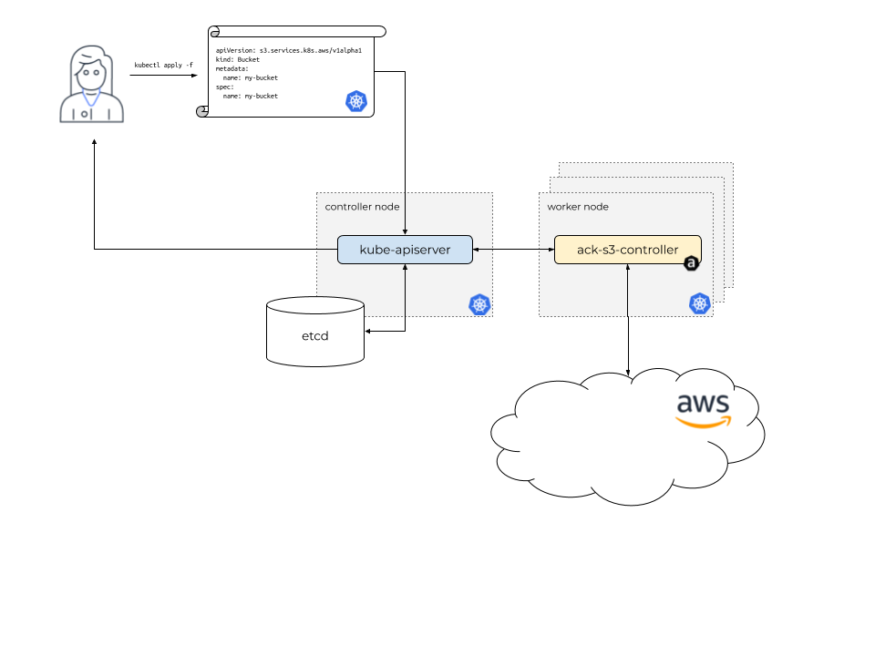

# terraform-aws-eks-ack

[](https://github.com/DNXLabs/terraform-aws-eks-ack/actions)
[](https://github.com/DNXLabs/terraform-aws-eks-ack/blob/master/LICENSE)


Terraform module for deploying Kubernetes [AWS Controllers for Kubernetes (ACK)](https://aws.github.io/aws-controllers-k8s/); letting you define and use AWS service resources directly from Kubernetes.

With ACK, you can take advantage of AWS managed services for your Kubernetes applications without needing to define resources outside the cluster or run services that provide supporting capabilities like databases or message queues within the cluster.

## Usage

```hcl
module "ack" {
  source = "git::https://github.com/DNXLabs/terraform-aws-eks-ack.git?ref=0.3.0"

  enabled = true

  cluster_name                     = module.eks_cluster.cluster_name
  cluster_identity_oidc_issuer     = module.eks_cluster.cluster_oidc_issuer_url
  cluster_identity_oidc_issuer_arn = module.eks_cluster.oidc_provider_arn
  aws_region                       = data.aws_region.current.name

  helm_services = [
    {
      name     = "s3"
      version  = "v0.1.6"
    }
  ]
}
```

## Connecting Kubernetes and AWS APIs



[ACK](https://github.com/aws/aws-controllers-k8s/) is a collection of [Kubernetes Custom Resource Definitions](https://kubernetes.io/docs/concepts/extend-kubernetes/api-extension/custom-resources/) (CRDs) and controllers which work together to extend the Kubernetes API and create AWS resources on your cluster’s behalf.

ACK comprises a set of Kubernetes custom [controllers](https://kubernetes.io/docs/reference/glossary/?fundamental=true#term-controller). Each controller manages [custom resources](https://kubernetes.io/docs/concepts/extend-kubernetes/api-extension/custom-resources/) representing API resources of a single AWS service API. For example, the ACK service controller for AWS Simple Storage Service (S3) manages custom resources that represent AWS S3 buckets.

Instead of logging into the AWS console or using the aws CLI tool to interact with the AWS service API, Kubernetes users can install a controller for an AWS service and then create, update, read and delete AWS resources using the Kubernetes API.

This means they can use the Kubernetes API and configuration language to fully describe both their containerized applications, using Kubernetes resources like Deployment and Service, as well as any AWS service resources upon which those applications depend.

## Demo

#### S3 Bucket

```yaml
apiVersion: s3.services.k8s.aws/v1alpha1
kind: Bucket
metadata:
  name: "<redact>"
  namespace: default
spec:
  name: "<redact>"
```

#### ECR Repository

```yaml
apiVersion: "ecr.services.k8s.aws/v1alpha1"
kind: Repository
metadata:
  name: "<redact>"
spec:
  repositoryName: <redact>
  encryptionConfiguration:
      encryptionType: AES256
  tags:
  - key: "is-encrypted"
    value: "true"
```


<!--- BEGIN_TF_DOCS --->

## Providers

| Name      | Version  |
|-----------|----------|
| terraform | \>= 0.13 |
| aws       | \>= 4.40 |
| helm      | \>= 2.8  |
## Inputs

| Name                                 | Description                                                                                                      | Type                                                                                                                 | Default                                                                                                                                                                   | Required |
|--------------------------------------|------------------------------------------------------------------------------------------------------------------|----------------------------------------------------------------------------------------------------------------------|---------------------------------------------------------------------------------------------------------------------------------------------------------------------------|:--------:|
| aws\_region                          | AWS region where services are stored.                                                                            | `string`                                                                                                             | n/a                                                                                                                                                                       |   yes    |
| aws\_partition                       | AWS Partition where services are stored.                                                                         | `string`                                                                                                             | `aws`                                                                                                                                                                     |    no    |
| cluster\_identity\_oidc\_issuer      | The OIDC Identity issuer for the cluster.                                                                        | `string`                                                                                                             | n/a                                                                                                                                                                       |   yes    |
| cluster\_identity\_oidc\_issuer\_arn | The OIDC Identity issuer ARN for the cluster that can be used to associate IAM roles with a service account.     | `string`                                                                                                             | n/a                                                                                                                                                                       |   yes    |
| cluster\_name                        | The name of the cluster                                                                                          | `string`                                                                                                             | n/a                                                                                                                                                                       |   yes    |
| create\_namespace                    | Whether to create Kubernetes namespace with name defined by `namespace`.                                         | `bool`                                                                                                               | `true`                                                                                                                                                                    |    no    |
| enabled                              | Variable indicating whether deployment is enabled.                                                               | `bool`                                                                                                               | `true`                                                                                                                                                                    |    no    |
| helm\_services                       | n/a                                                                                                              | <pre>list(object({<br>    name       = string<br>    policy_arn = string<br>    settings   = map(any)<br>  }))</pre> | <pre>[<br>  {<br>    "name": "s3",<br>    "policy_arn": "arn:aws:iam::aws:policy/AmazonS3FullAccess",<br>    "version": "v0.1.6",<br>    "settings": {}<br>  }<br>]</pre> |    no    |
| mod\_dependency                      | Dependence variable binds all AWS resources allocated by this module, dependent modules reference this variable. | `any`                                                                                                                | `null`                                                                                                                                                                    |    no    |
| namespace                            | Kubernetes namespace to deploy ACK Helm chart.                                                                   | `string`                                                                                                             | `"ack-system"`                                                                                                                                                            |    no    |
| settings                             | Additional settings which will be passed to the Helm chart values.                                               | `map`                                                                                                                | `{}`                                                                                                                                                                      |    no    |

## Outputs

No output.

<!--- END_TF_DOCS --->

## Authors

Module managed by [DNX Solutions](https://github.com/DNXLabs).

## License

Apache 2 Licensed. See [LICENSE](https://github.com/DNXLabs/terraform-aws-eks-ack/blob/master/LICENSE) for full details.
